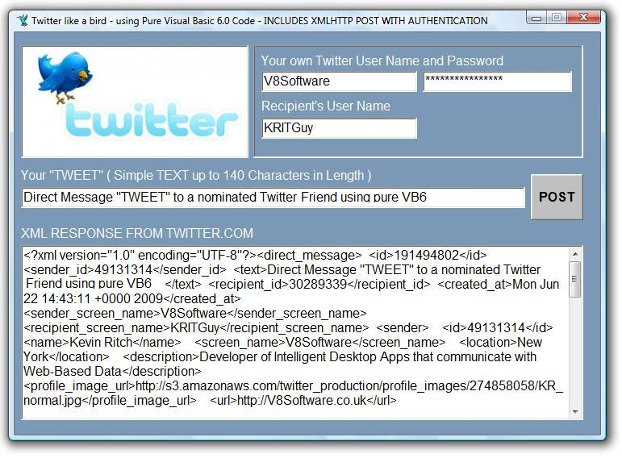



## TWITTER FUN \- Tweet like a Bird with full Authentication in pure VB Code

### Description

Twitter is the fastest growing web app since Google. So, using the Twitter API and a little bit of stuff from my earlier submissions, I present to you: BASIC DIRECT TWEETING.

This is the POST method to AUTHENTICATE your user name and password when sending a DIRECT MESSAGE to your nominated Twitter Friend.

Please read the Twitter API. When you sign-in to Twitter, it's at the bottom of the screen.

Also, know that you are limited by Twitter to 100 submissions per hour.

And also realize that Twitter Spam is not acceptable. Period.

But please enjoy this submission and throw it some votes too, if it get you off to a start with TWITTER.
 
### More Info
 

             |
---                |---
**Submitted On**   |2009-06-22 10:52:12
**By**             |[Kevin Ritch](https://github.com/Planet-Source-Code/PSCIndex/blob/master/ByAuthor/kevin-ritch.md)
**Level**          |Advanced
**User Rating**    |5.0 (10 globes from 2 users)
**Compatibility**  |VB 6\.0
**Category**       |[Complete Applications](https://github.com/Planet-Source-Code/PSCIndex/blob/master/ByCategory/complete-applications__1-27.md)
**World**          |[Visual Basic](https://github.com/Planet-Source-Code/PSCIndex/blob/master/ByWorld/visual-basic.md)
**Archive File**   |[TWITTER\_FU2155576222009\.zip](https://github.com/Planet-Source-Code/kevin-ritch-twitter-fun-tweet-like-a-bird-with-full-authentication-in-pure-vb-code__1-72198/archive/master.zip)

